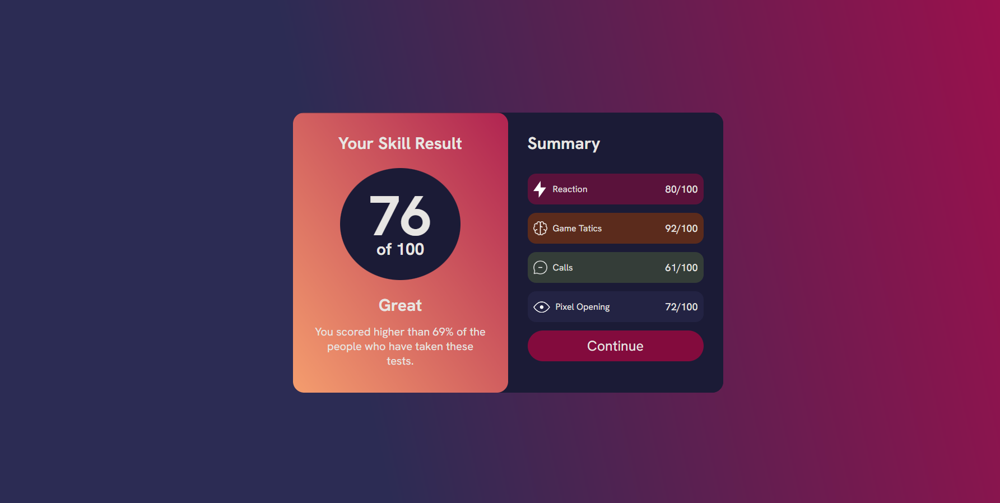
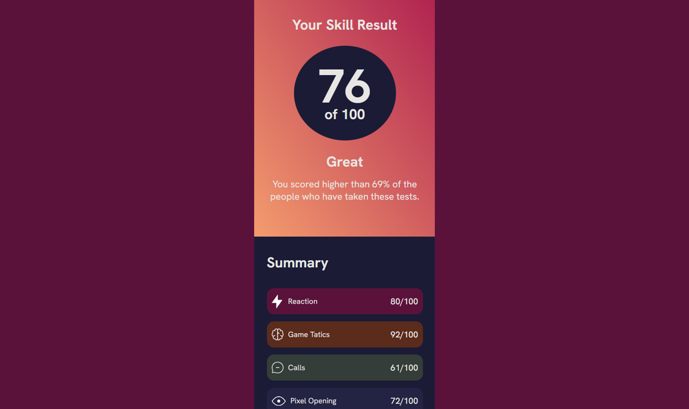

# FPS Games Test Results - Summary Page
### Site showing test results to FPS players who want measure their skills, and discover which skill points they need enhance

---

# Processo

## Design
### Design e layout feito usando pacote Adobe 

1 - Obter referência e layout

2 - Escolher tema e obter assets originais

3 - Escolher cores

## Planejamento

1 - Fazer desenho de caixas antes de escrever qualquer código, definindo quais elementos serão usados (desenho no pdf abaixo)

### Aqui há um pdf com todos os assets, design, planejamento e referência de layout

([Design-summary-component-main-assets](https://drive.google.com/file/d/1i4Xv5dxNV40jS_cO7Qk36fPeIRnfLchN/view?usp=sharing))

---

## Código
### Optei por começar no desktop primeiro (desktop first)

### Html 

1 - Definir duas "section" para os dois lados da carta (Results e Summary)

#### Results

a - Inserir os dados, como o "h2" e "p" da descrição, aqui usei uma div para fazer o círculo azul e inserir os números dentro, deixando ele como um círculo perfeito usando "porcentagem" no border-radius da div

#### Summary

a - Para as categorias usei uma "ul" com 4 "li's" dentro, usando display: flex; e direction: column; na div principal para deixar os itens um em baixo do outro, em cada "li" há dois "p" e o ícone na esquerda dos itens foi inserido no css usando a propriedade ":before"  

#### Geral

2 - Centralizar a carta usando display: flex (justify-content e align-items),

3 - Ajustar responsivo em diferentes resoluções (740px, 490px)

4 - Reescrever CSS/HTML Code, reduzindo e removendo código desnecessário utilizando princípios de Clean Code, e combinação de classes

### Fazer versionamento quando;
- Html escrito
- Css escrito
- Clean code
- Ajuste de metadata e inserção de "Readme.md"

# Tecnologias utilizadas
- HTML5 Markup 
- CSS
- Clean Code
- Photoshop
- Illustrator

# O que eu aprendi

#### CSS
- Criar formas redondas usando "porcentagem" no border-radius e inserir imagens (ícones nesse contexto) antes de elementos usando ":before" assim deixando o html com menos código (mais limpo), consolidação de conhecimento em display: flex; conseguindo posicionar elementos de forma fácil e rápida

# Dificuldades
- Fazer o background usar a altura total da tela em resoluções menores que 740px, min-height: 100vh; não estava funcionado, solucionei usando "%" ao invés de "vh".
---

# Autor
### Jefferson Augusto (a.k.a Benssssss) 
[Linkedin](https://www.linkedin.com/in/benssssss/)

## Projeto Nº5
